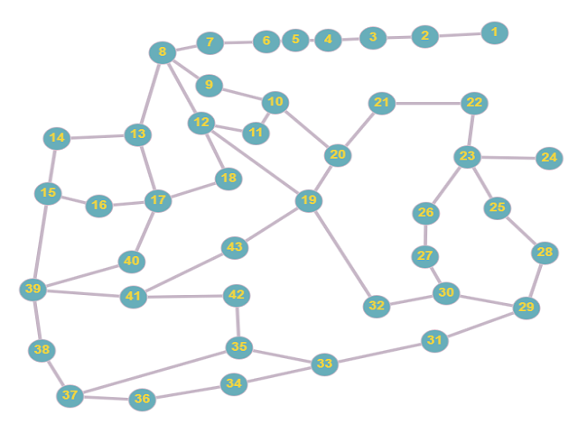
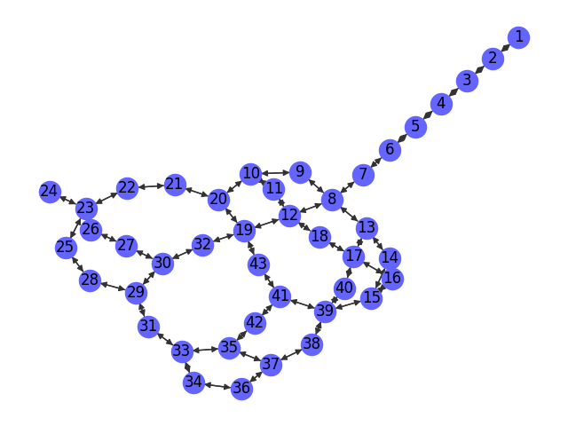

# La Torre Encantada

## Descripción
"La Torre Encantada" es una simulación automatizada desarrollada en Python con Pygame. Este programa permite a los usuarios observar múltiples iteraciones de un juego en el que intervienen un héroe y una bruja, moviéndose de forma autónoma a través de un grafo. El objetivo es estudiar las estadísticas y patrones del juego utilizando el método de Monte Carlo.

## Características
- Simulación automatizada de movimientos de personajes en un grafo.
- Visualización gráfica del juego utilizando Pygame.
- Análisis estadístico de resultados utilizando el método de Monte Carlo.
- Registro de resultados en `output/game_log.csv` para análisis detallados.

Aquí tienes una forma de incorporar la información sobre el acceso al grafo en graphonline.ru en tu archivo README:

---

## Visualización del Grafo

### Grafo en Graphonline.ru

El grafo original, definido como un diccionario en Python, se ha visualizado utilizando la herramienta online [graphonline.ru](https://graphonline.ru/en/). Esta herramienta permite una representación interactiva y visual del grafo, facilitando la comprensión de su estructura y conexiones.

La imagen que muestra esta visualización se encuentra en el directorio de assets bajo el nombre `assets/graphru.png`. Esta representación es útil para obtener una vista rápida y clara del grafo y sus relaciones.



Para ver y explorar interactivamente este grafo en graphonline.ru, puedes visitar el siguiente enlace: [Ver Grafo en Graphonline.ru](http://graphonline.ru/es/?graph=uYdBCksPktZJJLpBZZcst). Este enlace te llevará directamente a la visualización del grafo, donde podrás interactuar con él y ver más detalles sobre su estructura y conexiones.

### Grafo en NetworkX

Para una manipulación y análisis más profundos del grafo, se utilizó la biblioteca NetworkX en Python. NetworkX es una herramienta poderosa para la creación, manipulación y estudio de la estructura, dinámica y funciones de redes complejas.

Dado que el grafo está definido como un diccionario en Python, se utilizó NetworkX para convertirlo en un objeto de grafo y aplicar un layout para su visualización. El layout elegido fue `kamada_kawai_layout`, ya que ofrecía una distribución que se asemejaba más a la estructura original del grafo.

Es importante destacar que, aunque se utilizó un layout específico, la disposición de los nodos y aristas cambió ligeramente en comparación con la visualización original en graphonline.ru. Esto es normal, ya que los algoritmos de layout en NetworkX buscan optimizar la disposición basándose en diferentes criterios matemáticos y estéticos.

La imagen resultante de esta visualización con NetworkX se encuentra en el directorio de assets bajo el nombre `assets/networkx.png`.




## Componentes
El juego consta de varios módulos principales:
- `modulo_grafo.py`: Gestiona la representación gráfica del grafo del juego.
- `modulo_dado.py`: Simula un dado para determinar el número de pasos de los personajes.
- `game_display.py`: Maneja la visualización y la interfaz gráfica del juego.
- `game_manager.py`: Controla la lógica principal y la ejecución del juego.
- `personajes.py`: Define las reglas de movimiento y acciones de los personajes del juego.
- `game_logger.py`: Registra los eventos y resultados del juego para análisis posteriores.
- `montecarlo.py`: Realiza un análisis estadístico de los resultados del juego utilizando simulaciones de Monte Carlo.

## Requisitos
- Python 3.x
- Pygame
- NetworkX
- SciPy

## Instalación
Sigue estos pasos para instalar y ejecutar la simulación:
```
pip install pygame networkx scipy
python main.py
```

## Uso
Después de iniciar la simulación, el programa ejecutará automáticamente un número definido de iteraciones, mostrando las interacciones entre el héroe y la bruja. Las estadísticas y el progreso de cada iteración se visualizan en tiempo real.

## Modo Estadístico
Al finalizar las iteraciones, presiona 'S' para ver un análisis estadístico de las simulaciones, incluyendo probabilidades de victoria y patrones de movimiento, con los resultados almacenados en `output/game_log.csv`.

## Autor
Desarrollado por [moisesnks](https://github.com/moisesnks), Noviembre 2023.


## Contribuciones
Si deseas contribuir a este proyecto, sigue estas pautas:
- Realiza un fork del repositorio.
- Crea una rama para tus características o correcciones.
- Envía un pull request con tus cambios.

## Licencia
Este proyecto está bajo la Licencia MIT. Para más detalles, ver el archivo [LICENSE](LICENSE).
